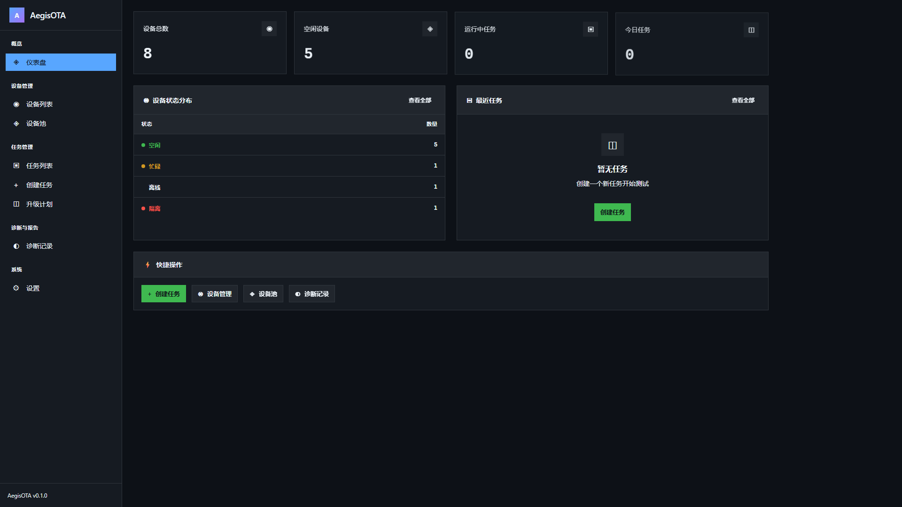
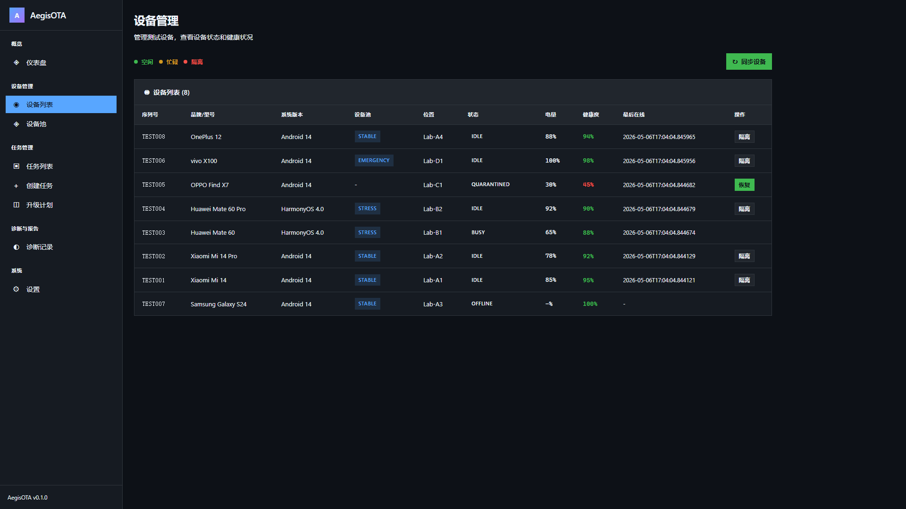
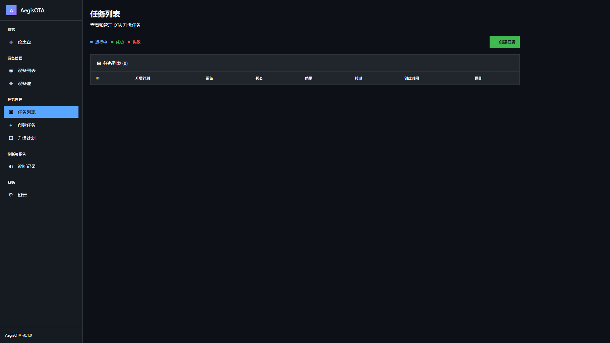
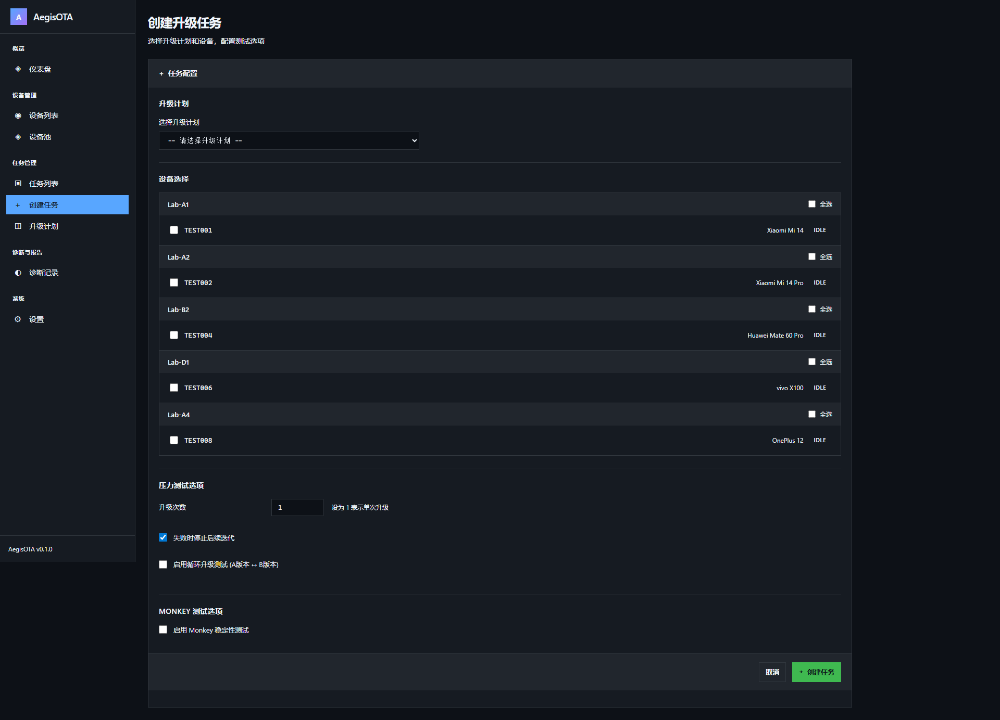
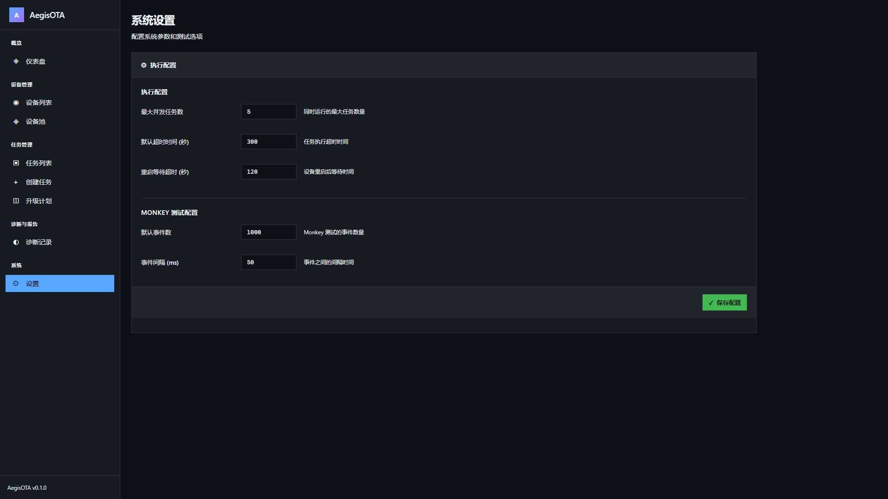
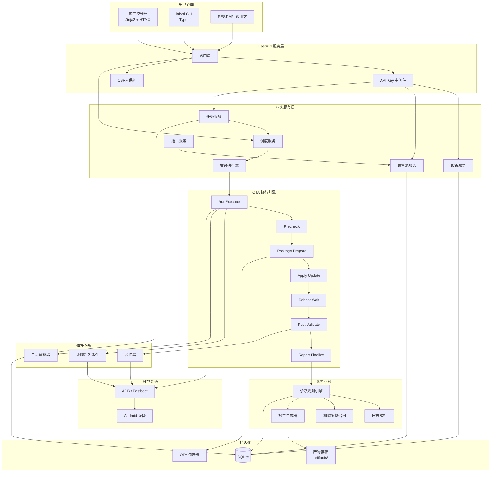

# AegisOTA

安卓 OTA 升级异常注入与多设备验证平台。

AegisOTA 面向测试开发和实验室设备管理场景，把 OTA 升级测试中的设备发现、设备池调度、升级任务执行、异常注入、日志采集、失败诊断和报告沉淀放到一套可追踪的平台里。它既可以通过网页控制台操作，也可以通过 REST 接口和 `labctl` 命令行接入自动化流程。

## 主要功能

### 设备管理

- 通过 ADB 同步已连接设备。
- 记录设备序列号、品牌、型号、系统版本、电量、健康分、标签和机位信息。
- 支持设备状态流转：`idle`、`reserved`、`busy`、`offline`、`quarantined`、`recovering`。
- 支持设备隔离与恢复，避免不稳定设备继续进入任务队列。
- 支持标签维护，用于后续按设备特征筛选任务。

### 设备池与调度

- 内置三类设备池用途：`stable`、`stress`、`emergency`。
- 设备池支持保留比例、最大并行数、标签选择器和启停配置。
- 调度服务按任务优先级和创建时间选择任务。
- 设备租约用于避免并发任务抢占同一台设备。
- 紧急任务可通过抢占服务释放低优先级任务占用的设备资源。

### 升级计划与任务

- 升级计划描述一类 OTA 测试模板，包括升级类型、升级包路径、目标版本、设备选择器、默认设备池和并行度。
- 当前升级类型：`full`、`incremental`、`rollback`。
- 任务会话记录单次执行，状态包括：

```text
queued -> allocating -> reserved -> running -> validating -> passed/failed/aborted/preempted
```

- 任务可绑定指定设备，也可进入队列后由调度器分配设备。
- 后台执行器从已预留任务中取出执行，并在结束后释放租约、保存产物和生成报告。

### OTA 执行流程

执行器按阶段编排 OTA 流程：

```text
precheck -> package_prepare -> apply_update -> reboot_wait -> post_validate
```

各阶段由 `app/executors/step_handlers.py` 处理，执行上下文记录时间线、产物目录、任务选项和设备信息。底层命令通过 ADB/Fastboot 包装执行，测试中也提供模拟执行器，便于验证流程。报告生成由后台执行器在流程结束后统一处理。

### 异常注入

故障以插件形式实现，插件提供 `prepare()`、`inject()`、`cleanup()` 生命周期。内置故障包括：

| 故障类型 | 默认阶段 | 作用 |
| --- | --- | --- |
| `low_battery` | `precheck` | 模拟低电量环境 |
| `storage_pressure` | `precheck` | 制造存储压力 |
| `package_corrupted` | `precheck` | 模拟升级包损坏或校验失败 |
| `download_interrupted` | `precheck` | 模拟下载/传输中断 |
| `reboot_interrupted` | `apply_update` | 模拟升级过程中的重启/连接中断 |
| `post_boot_watchdog_failure` | `post_validate` | 模拟升级后关键进程或看门狗异常 |
| `performance_regression` | `post_validate` | 检测升级后性能退化 |
| `monkey_after_upgrade` | `post_validate` | 升级后执行 Monkey 稳定性压测 |

### 诊断与报告

- 解析 recovery、update_engine、logcat、Monkey 等日志来源。
- 将日志归一化为结构化事件。
- 通过规则引擎匹配失败信号并给出置信度。
- 使用 RapidFuzz 做相似案例召回。
- 失败分类覆盖包问题、设备环境问题、启动失败、验证失败、Monkey 不稳定、性能疑似退化、ADB 传输异常和未知问题。
- 报告可生成 Markdown、HTML 或 JSON，并关联任务产物。

### 网页控制台

网页页面基于 Jinja2 + HTMX，提供：

- 仪表盘
- 设备列表
- 任务列表与任务详情
- 创建任务
- 升级计划
- 设备池列表与详情
- 诊断列表与诊断详情
- 设置页面

网页路由不走接口密钥中间件；写操作由 CSRF Token 保护。

### 界面截图

| 页面 | 截图 |
|------|------|
| 仪表盘 |  |
| 设备列表 |  |
| 任务列表 |  |
| 创建任务 |  |
| 设置页面 |  |

## 技术栈

| 层级 | 技术 |
| --- | --- |
| 语言 | Python 3.10+ |
| 网页服务 | FastAPI |
| ORM/数据库 | SQLAlchemy 2.0 + SQLite |
| 迁移 | Alembic |
| 命令行 | Typer |
| 页面 | Jinja2 + HTMX |
| 诊断规则 | YAML |
| 相似案例 | RapidFuzz |
| 测试 | pytest / pytest-asyncio |
| 代码质量 | Ruff / mypy |
| 依赖管理 | uv |

## 快速开始

### 环境要求

- Python 3.10+
- ADB/Fastboot 可用
- 至少一台 Android 测试设备
- 推荐使用 uv 管理虚拟环境

### 安装依赖

```bash
uv sync
```

也可以使用 pip 安装项目依赖：

```bash
pip install -e ".[dev]"
```

### 初始化数据库

应用启动时会自动初始化数据库表。需要使用迁移时可以执行：

```bash
alembic upgrade head
```

### 启动网页服务

```bash
uvicorn app.main:app --reload --host 0.0.0.0 --port 8000
```

访问：

- 网页控制台：`http://localhost:8000/`
- OpenAPI 文档：`http://localhost:8000/docs`
- 健康检查：`http://localhost:8000/health`

### 启动后台执行器

```bash
labctl worker start
```

也可以只处理一次任务轮询：

```bash
labctl worker run-once
```

## 命令行用法

`labctl` 是平台的命令行入口：

```bash
labctl --help
labctl version
```

### 设备

```bash
labctl device sync
labctl device list
labctl device quarantine SERIAL --reason "启动循环"
labctl device recover SERIAL
```

### 设备池

```bash
labctl pool init
labctl pool list
labctl pool create --name stable --purpose stable --reserved-ratio 0.2 --max-parallel 5
labctl pool show 1
labctl pool update 1 --reserved-ratio 0.1 --max-parallel 10
labctl pool assign 1 DEVICE_ID
```

### 任务

```bash
labctl run submit PLAN_ID --device SERIAL
labctl run list
labctl run list --status queued --limit 20
labctl run abort RUN_ID
labctl run execute RUN_ID
```

说明：当前命令行不包含创建升级计划命令，计划创建主要通过网页表单或 REST 接口完成。

### 报告

```bash
labctl report export RUN_ID --format markdown --output report.md
labctl report export RUN_ID --format html --output report.html
labctl report export RUN_ID --format json --output report.json
```

## REST 接口

接口前缀为 `/api/v1`。当 `AEGISOTA_API_KEYS` 配置了有效密钥且接口密钥开关开启时，请求需要带上：

```text
X-API-Key: <你的接口密钥>
```

### 常用端点

| 模块 | 方法与路径 | 说明 |
| --- | --- | --- |
| 设备 | `GET /api/v1/devices` | 设备列表 |
| 设备 | `GET /api/v1/devices/{serial}` | 设备详情 |
| 设备 | `POST /api/v1/devices/sync` | 同步 ADB 设备 |
| 设备 | `POST /api/v1/devices/{serial}/quarantine` | 隔离设备 |
| 设备 | `POST /api/v1/devices/{serial}/recover` | 恢复设备 |
| 设备 | `PUT /api/v1/devices/{serial}/tags` | 更新设备标签 |
| 设备池 | `GET /api/v1/pools` | 设备池列表 |
| 设备池 | `POST /api/v1/pools` | 创建设备池 |
| 设备池 | `GET /api/v1/pools/{pool_id}` | 设备池详情 |
| 设备池 | `PUT /api/v1/pools/{pool_id}` | 更新设备池 |
| 设备池 | `POST /api/v1/pools/{pool_id}/assign` | 分配设备到池 |
| 设备池 | `GET /api/v1/pools/{pool_id}/capacity` | 查询池容量 |
| 计划 | `GET /api/v1/runs/plans` | 升级计划列表 |
| 计划 | `POST /api/v1/runs/plans` | 创建升级计划 |
| 计划 | `PUT /api/v1/runs/plans/{plan_id}` | 更新升级计划 |
| 计划 | `DELETE /api/v1/runs/plans/{plan_id}` | 删除升级计划 |
| 任务 | `GET /api/v1/runs` | 任务列表 |
| 任务 | `POST /api/v1/runs` | 创建任务 |
| 任务 | `GET /api/v1/runs/{run_id}` | 任务详情 |
| 任务 | `POST /api/v1/runs/{run_id}/reserve` | 预留任务设备 |
| 任务 | `POST /api/v1/runs/{run_id}/abort` | 中止任务 |
| 报告 | `GET /api/v1/reports/{run_id}` | 报告摘要 |
| 报告 | `GET /api/v1/reports/{run_id}/html` | HTML 报告 |
| 报告 | `GET /api/v1/reports/{run_id}/markdown` | Markdown 报告 |
| 报告 | `GET /api/v1/reports/{run_id}/artifacts` | 任务产物 |
| 诊断 | `GET /api/v1/diagnosis` | 诊断记录 |
| 诊断 | `GET /api/v1/diagnosis/{run_id}` | 诊断详情 |
| 诊断 | `POST /api/v1/diagnosis/{run_id}/run` | 手动触发诊断 |
| 诊断 | `POST /api/v1/diagnosis/export-logs/{run_id}` | 从设备导出日志 |
| 诊断 | `GET /api/v1/diagnosis/{run_id}/export` | 导出诊断报告 |

### API 示例

创建设备池：

```bash
curl -X POST http://localhost:8000/api/v1/pools \
  -H "Content-Type: application/json" \
  -d '{
    "name": "stable",
    "purpose": "stable",
    "reserved_ratio": 0.2,
    "tag_selector": {"tags": ["android14"]},
    "enabled": true
  }'
```

创建升级计划：

```bash
curl -X POST http://localhost:8000/api/v1/runs/plans \
  -H "Content-Type: application/json" \
  -d '{
    "name": "Android 15 全量包",
    "upgrade_type": "full",
    "package_path": "ota_packages/full/update.zip",
    "target_build": "android15-userdebug",
    "default_pool_id": 1,
    "parallelism": 1
  }'
```

创建任务：

```bash
curl -X POST http://localhost:8000/api/v1/runs \
  -H "Content-Type: application/json" \
  -d '{
    "plan_id": 1,
    "device_serial": "ABC123"
  }'
```

### Python API 调用示例

```python
import httpx

BASE_URL = "http://localhost:8000"

# 获取设备列表
with httpx.Client() as client:
    resp = client.get(f"{BASE_URL}/api/v1/devices")
    devices = resp.json()["data"]

# 创建任务
with httpx.Client() as client:
    resp = client.post(
        f"{BASE_URL}/api/v1/runs",
        json={"plan_id": 1, "device_serial": "ABC123"}
    )
    run = resp.json()
```

### 错误响应

所有错误返回统一格式：

```json
{
  "detail": "错误描述信息",
  "code": "ERROR_CODE"
}
```

**常见错误码：**

| 状态码 | 说明 |
|--------|------|
| 400 | 请求参数无效 |
| 401 | API Key 无效或缺失 |
| 404 | 资源不存在 |
| 409 | 资源冲突（如设备已被占用） |
| 500 | 服务器内部错误 |

> 更详细的 API 文档请参考 [docs/API.md](docs/API.md)。

## 配置

配置通过 `app.config.Settings` 管理，环境变量统一使用 `AEGISOTA_` 前缀。常用配置：

| 变量 | 默认值 | 说明 |
| --- | --- | --- |
| `AEGISOTA_DATABASE_URL` | `sqlite:///./aegisota.db` | 数据库地址 |
| `AEGISOTA_ARTIFACTS_DIR` | `artifacts` | 执行产物目录 |
| `AEGISOTA_OTA_PACKAGES_DIR` | `ota_packages` | OTA 包目录 |
| `AEGISOTA_MAX_CONCURRENT_RUNS` | `5` | 最大并发任务数 |
| `AEGISOTA_LEASE_DEFAULT_DURATION` | `3600` | 默认设备租约时长 |
| `AEGISOTA_API_KEY_ENABLED` | `true` | 接口密钥开关 |
| `AEGISOTA_API_KEYS` | 空 | 逗号分隔的接口密钥列表 |
| `AEGISOTA_LOG_LEVEL` | `INFO` | 日志级别 |

初始化配置时会自动创建 `artifacts/`、`ota_packages/full/` 和 `ota_packages/incremental/`。

## 代码结构

```text
app/
├── api/            # REST 接口与网页路由
├── cli/            # labctl 命令
├── services/       # 业务服务、调度、抢占、后台执行器
├── executors/      # OTA 执行器、ADB 包装、阶段处理
├── faults/         # 故障注入插件
├── validators/     # 启动、版本、性能、Monkey 验证
├── parsers/        # 日志解析与事件归一化
├── diagnosis/      # 规则加载、匹配、置信度、相似案例
├── reporting/      # 报告生成与失败分类
├── models/         # SQLAlchemy 模型和枚举
├── templates/      # Jinja2 页面
├── static/         # CSS 与静态资源
├── rules/          # 内置诊断规则
├── utils/          # 日志与事务工具
├── config.py       # 配置
├── database.py     # 数据库初始化
└── main.py         # FastAPI 入口

tests/
├── test_api/
├── test_cli/
├── test_executors/
├── test_faults/
├── test_models/
├── test_reporting/
├── test_services/
├── test_utils/
└── test_validators/
```

## 开发

运行测试：

```bash
pytest
```

按模块运行：

```bash
pytest tests/test_api/
pytest tests/test_services/
pytest tests/test_executors/
pytest tests/test_faults/
pytest tests/test_validators/
```

格式化与检查：

```bash
ruff format app tests
ruff check app tests
mypy app tests
```

数据库迁移：

```bash
alembic revision --autogenerate -m "描述变更"
alembic upgrade head
```

## 适合扩展的方向

- 新增故障插件：放在 `app/faults/`，实现 `FaultPlugin` 生命周期。
- 新增验证器：放在 `app/validators/`，返回结构化验证结果。
- 新增日志解析器：放在 `app/parsers/`，输出可诊断的归一化事件。
- 调整调度策略：优先查看 `run_service`、`scheduler_service`、`worker_service` 和 `preemption_service`。
- 调整诊断能力：同步维护 `app/rules/core_rules.yaml`、解析器、诊断服务和报告模板。

## 端到端使用示例

以下示例演示从设备连接到任务执行、故障注入、报告生成的完整流程。

### 1. 连接设备并同步

```bash
# 确认 ADB 已识别设备
adb devices

# 同步设备到平台
labctl device sync

# 查看设备列表
labctl device list
```

### 2. 初始化设备池

```bash
# 初始化默认设备池
labctl pool init

# 创建设备池
labctl pool create --name stable --purpose stable --reserved-ratio 0.2 --max-parallel 5
```

### 3. 创建升级计划并下发任务

```bash
# 通过 REST 接口创建升级计划
curl -X POST http://localhost:8000/api/v1/runs/plans \
  -H "Content-Type: application/json" \
  -d '{
    "name": "Android 15 全量升级",
    "upgrade_type": "full",
    "package_path": "ota_packages/full/update.zip",
    "target_build": "android15-userdebug",
    "default_pool_id": 1,
    "parallelism": 1
  }'

# 创建任务（指定设备序列号）
curl -X POST http://localhost:8000/api/v1/runs \
  -H "Content-Type: application/json" \
  -d '{
    "plan_id": 1,
    "device_serial": "ABC123XYZ"
  }'
```

### 4. 启动后台执行器

```bash
# 启动持续监听任务的 worker
labctl worker start
```

### 5. 注入故障（可选）

在升级计划中指定故障类型，例如在升级后执行 Monkey 压测：

```json
{
  "plan_id": 1,
  "device_serial": "ABC123XYZ",
  "options": {
    "fault_plugins": ["monkey_after_upgrade", "storage_pressure"]
  }
}
```

### 6. 查看任务状态与报告

```bash
# 查看任务列表
labctl run list

# 导出 Markdown 报告
labctl report export 1 --format markdown --output report.md

# 导出 HTML 报告
labctl report export 1 --format html --output report.html
```

## 环境变量配置示例

在项目根目录创建 `.env` 文件，填入以下配置：

```env
# 数据库配置
AEGISOTA_DATABASE_URL=sqlite:///./aegisota.db

# 产物与 OTA 包存储路径
AEGISOTA_ARTIFACTS_DIR=artifacts
AEGISOTA_OTA_PACKAGES_DIR=ota_packages

# 任务并发与租约
AEGISOTA_MAX_CONCURRENT_RUNS=5
AEGISOTA_LEASE_DEFAULT_DURATION=3600

# API 密钥配置
AEGISOTA_API_KEY_ENABLED=true
AEGISOTA_API_KEYS=your-secret-key-here,another-key-if-needed

# 日志级别
AEGISOTA_LOG_LEVEL=INFO

# 可选：ADB 路径（如未加入系统 PATH）
# AEGISOTA_ADB_PATH=/path/to/adb

# 可选：设备标签过滤
# AEGISOTA_DEVICE_TAG_FILTER=android14,pixel

# 可选：任务轮询间隔（秒）
# AEGISOTA_WORKER_POLL_INTERVAL=5
```

应用启动时会自动加载 `.env` 文件，所有配置均通过 `app.config.Settings` 管理。

## ADB 验证步骤

在执行 OTA 任务之前，请确保 ADB 连接正常：

### 1. 检查设备连接

```bash
adb devices
```

预期输出：

```text
List of devices attached
ABC123XYZ    device
DEF456UVW    device
```

### 2. 验证设备信息

```bash
# 查看设备型号
adb -s ABC123XYZ shell getprop ro.product.model

# 查看系统版本
adb -s ABC123XYZ shell getprop ro.build.version.release

# 查看电量状态
adb -s ABC123XYZ dumpsys battery

# 查看存储使用情况
adb -s ABC123XYZ shell df /data
```

### 3. 验证 USB 调试授权

如果设备显示 `unauthorized`，请在设备屏幕上点击允许 USB 调试：

```bash
adb devices
# 状态应从 unauthorized 变为 device
```

### 4. 同步设备到平台

```bash
labctl device sync
labctl device list
```

确认设备状态为 `idle` 后即可参与任务调度。

### 5. 常见问题排查

| 问题 | 解决方法 |
| --- | --- |
| 设备未显示 | 检查 USB 连接、开发者选项、USB 调试开关 |
| `no permissions` | 执行 `adb kill-server && adb start-server` |
| `offline` 状态 | 重新插拔 USB 或在设备上撤销并重新授权调试 |
| 多设备命令混淆 | 使用 `-s <serial>` 指定目标设备 |

## 系统架构



### 架构深入说明

<details>
<summary>控制面与执行面分层设计</summary>

AegisOTA 采用"控制面 + 执行面"的分层架构设计，实现任务调度与命令执行的解耦。

**控制面（Control Plane）**
- FastAPI Web Service：提供 REST API 和 Web 控制台
- Service Layer：业务逻辑层，处理设备管理、任务调度、报告生成等
- SQLite Database：数据持久化

**执行面（Execution Plane）**
- Worker Process：后台任务执行器
- RunExecutor：OTA 流程编排器
- Fault Injector：故障注入插件
- Validation Modules：升级后验证模块
- Command Runner：ADB/Fastboot 命令执行器

</details>

<details>
<summary>核心模块职责</summary>

**API 层（`app/api/`）**

| 模块 | 职责 |
|------|------|
| `devices.py` | 设备 CRUD、同步、隔离、恢复 |
| `pools.py` | 设备池管理、容量查询 |
| `runs.py` | 任务创建、查询、终止 |
| `plans.py` | 升级计划管理 |
| `reports.py` | 报告生成与导出 |
| `diagnosis.py` | 日志诊断与规则管理 |
| `web.py` | Web 页面路由 |

**服务层（`app/services/`）**

| 服务 | 职责 |
|------|------|
| `DeviceService` | 设备生命周期管理 |
| `PoolService` | 设备池容量与分配 |
| `RunService` | 任务状态机与调度 |
| `WorkerService` | Worker 任务协调 |
| `LogExportService` | 设备日志导出 |
| `DiagnosisService` | 日志分析与诊断 |
| `ReportService` | 报告生成 |

**执行层（`app/executors/`）**

| 模块 | 职责 |
|------|------|
| `RunExecutor` | 任务全流程编排 |
| `StepHandler` | 各阶段处理器 |
| `ADBExecutor` | ADB 命令封装 |
| `CommandRunner` | 通用命令执行 |
| `RunContext` | 执行上下文 |

**异常注入层（`app/faults/`）**

故障注入插件系统，插件提供 `prepare()`、`inject()`、`cleanup()` 生命周期。

**诊断层（`app/diagnosis/` + `app/parsers/`）**

TraceLens 日志分析引擎，包括日志解析器和诊断引擎。

**验证器层（`app/validators/`）**

| 验证器 | 职责 |
|--------|------|
| `BootCheck` | 启动完成检查 |
| `VersionCheck` | 版本号验证 |
| `PerfCheck` | 性能基准检查 |
| `MonkeyRunner` | Monkey 稳定性测试 |
| `StateMachine` | 状态转换验证 |

</details>

<details>
<summary>数据模型与状态机</summary>

**核心实体关系**

```
┌──────────────┐       ┌──────────────┐
│  DevicePool  │       │ UpgradePlan  │
└──────┬───────┘       └──────┬───────┘
       │                      │
       │ 1:N                  │ 1:N
       ▼                      ▼
┌──────────────┐       ┌──────────────┐
│    Device    │       │  RunSession  │
└──────┬───────┘       └──────┬───────┘
       │                      │
       │ N:M (Lease)          │ 1:N
       └──────────────────────┼──────────────┐
                              │              │
                              ▼              ▼
                       ┌────────────┐  ┌────────────┐
                       │  RunStep   │  │  Artifact  │
                       └────────────┘  └────────────┘
```

**任务状态转换**

```
QUEUED -> ALLOCATING -> RESERVED -> RUNNING -> VALIDATING -> PASSED/FAILED/ABORTED
```

**设备状态转换**

```
OFFLINE -> IDLE -> RESERVED -> BUSY -> QUARANTINED
```

</details>

<details>
<summary>设计决策</summary>

| 决策 | 选择 | 理由 |
|------|------|------|
| **数据库** | SQLite | 单机部署足够，零运维成本 |
| **Web 框架** | FastAPI | 高性能、类型安全、自动文档 |
| **前端** | Jinja2 + HTMX | 轻量级，无需构建流程 |
| **Worker** | 单机进程 | 避免 Celery 复杂度 |
| **异常注入** | 插件化 | 易扩展，独立封装 |
| **命令执行** | CommandRunner | 统一抽象，易于测试 |

</details>

> 更详细的架构文档请参考 [docs/architecture.md](docs/architecture.md)。

## 贡献指南

感谢对 AegisOTA 项目的关注！本文档介绍如何参与项目开发。

### 快速链接

- [项目仓库](https://github.com/MuyuQ/AegisOTA)
- [Issue 追踪](https://github.com/MuyuQ/AegisOTA/issues)
- [API 文档](docs/API.md)
- [架构文档](docs/architecture.md)

### 开发环境设置

**系统要求**

- Python 3.10+
- Git
- ADB (Android Debug Bridge) - 可选，用于集成测试

**安装步骤**

1. **克隆仓库**

```bash
git clone https://github.com/MuyuQ/AegisOTA.git
cd AegisOTA
```

2. **创建虚拟环境**

```bash
python -m venv .venv
# Windows
.venv\Scripts\activate
# Linux/macOS
source .venv/bin/activate
```

3. **安装依赖**

```bash
# 使用 pip
pip install -e ".[dev]"

# 或使用 uv (推荐，更快)
uv pip install -e ".[dev]"
```

4. **验证安装**

```bash
# CLI 应该可用
labctl --help

# 运行测试
pytest tests/ -v
```

5. **启动开发服务**

```bash
# 数据库会自动创建
uvicorn app.main:app --reload
```

访问 http://localhost:8000/docs 查看 API 文档。

### 编码规范

**Python 风格**

- 遵循 [PEP 8](https://pep8.org/)
- 使用类型注解
- 函数长度不超过 50 行
- 类长度不超过 300 行

**命名约定**

| 类型 | 约定 | 示例 |
|------|------|------|
| 模块 | `snake_case` | `device_service.py` |
| 类 | `PascalCase` | `DeviceService` |
| 函数/方法 | `snake_case` | `get_device_by_id` |
| 常量 | `UPPER_SNAKE_CASE` | `DEFAULT_TIMEOUT` |
| 私有方法 | `_leading_underscore` | `_validate_input` |

**文档字符串**

使用中文，遵循 Google 风格：

```python
def get_device(device_id: int) -> Device:
    """获取设备详情。

    Args:
        device_id: 设备 ID

    Returns:
        Device: 设备对象

    Raises:
        HTTPException: 设备不存在时抛出 404
    """
```

### Git 工作流

**分支管理**

```
main          - 主分支，保护状态
├── feature/xxx  - 新功能
├── fix/xxx      - Bug 修复
└── docs/xxx     - 文档更新
```

**提交消息格式**

使用 Conventional Commits：

```
<type>(<scope>): <description>

[optional body]

[optional footer]
```

**类型说明：**

| Type | 说明 |
|------|------|
| `feat` | 新功能 |
| `fix` | Bug 修复 |
| `docs` | 文档更新 |
| `style` | 代码格式 |
| `refactor` | 重构 |
| `test` | 测试相关 |
| `chore` | 构建/工具 |

**示例：**

```bash
feat(api): add device pool capacity endpoint

- Add GET /api/pools/{id}/capacity
- Return available/reserved/busy counts
- Add utilization percentage

Closes #42
```

**提交前检查清单**

```bash
# 1. 代码格式化
ruff format app/
ruff check app/

# 2. 运行测试
pytest tests/ -v

# 3. 运行覆盖率 (可选)
pytest --cov=app --cov-report=term-missing

# 4. 检查变更
git diff
```

### 测试指南

**运行测试**

```bash
# 全部测试
pytest

# 特定模块
pytest tests/test_services/ -v

# 特定文件
pytest tests/test_api/test_devices.py::test_get_device -v

# 带覆盖率
pytest --cov=app --cov-report=html
open htmlcov/index.html
```

**编写测试**

```python
# tests/test_services/test_device_service.py
import pytest
from app.services.device_service import DeviceService

class TestDeviceService:
    @pytest.fixture
    def db(self):
        # 测试数据库
        ...

    @pytest.fixture
    def service(self, db):
        return DeviceService(db)

    def test_sync_discovers_devices(self, service, mock_adb):
        """测试同步发现设备。"""
        mock_adb.list_devices.return_value = [("ABC123", "device")]

        result = service.sync_devices()

        assert result.discovered == 1
        assert result.registered == 0
```

**Mock 外部依赖**

```python
from unittest.mock import patch, MagicMock

@patch("app.executors.adb_executor.subprocess")
def test_adb_command(mock_subprocess):
    mock_subprocess.run.return_value = MagicMock(returncode=0, stdout="OK")

    # 测试代码
```

### 开发功能

**添加 API 端点**

1. 创建路由文件

```python
# app/api/my_feature.py
from fastapi import APIRouter, HTTPException

router = APIRouter(prefix="/api/my-feature", tags=["my-feature"])

@router.get("/")
def list_items():
    """列出项目。"""
    return {"items": []}

@router.post("/")
def create_item(name: str):
    """创建项目。"""
    return {"id": 1, "name": name}
```

2. 注册路由

```python
# app/main.py
from app.api import my_feature

app.include_router(my_feature.router)
```

3. 编写测试

```python
# tests/test_api/test_my_feature.py
def test_list_items(client):
    resp = client.get("/api/my-feature")
    assert resp.status_code == 200
    assert "items" in resp.json()
```

**添加异常注入插件**

1. 创建插件类

```python
# app/faults/my_fault.py
from app.faults.base import FaultPlugin, FaultResult
from app.executors.run_context import RunContext

class MyFault(FaultPlugin):
    """我的故障注入。"""

    fault_type = "my_fault"
    fault_stage = "precheck"

    def prepare(self, context: RunContext) -> None:
        # 准备条件
        pass

    def inject(self, context: RunContext) -> FaultResult:
        # 注入故障
        return FaultResult(success=True)

    def cleanup(self, context: RunContext) -> None:
        # 清理恢复
        pass
```

2. 注册插件

```python
# app/faults/__init__.py
from app.faults.my_fault import MyFault

FAULT_PLUGINS = {
    "my_fault": MyFault,
    # ...
}
```

### Pull Request 流程

**PR 模板**

```markdown
## 变更说明
简要描述变更内容和原因。

## 相关 Issue
Closes #123

## 测试
- [ ] 已添加单元测试
- [ ] 已运行所有测试
- [ ] 覆盖率无下降

## 检查清单
- [ ] 代码已格式化 (ruff format)
- [ ] 通过代码检查 (ruff check)
- [ ] 已更新文档
```

**审核流程**

1. 创建 PR
2. CI 自动运行测试
3. 维护者审核
4. 根据反馈修改
5. 合并到 main

### 安全注意事项

- **禁止**硬编码敏感信息（使用环境变量或配置文件）
- **禁止**使用 `shell=True` 执行用户输入
- **务必**验证所有用户输入
- **务必**使用参数化查询
- **务必**为新 API 添加认证保护

### 获取帮助

- 提交 Issue：https://github.com/MuyuQ/AegisOTA/issues
- 查看现有讨论

感谢你的贡献！

## 详细文档

- [系统架构详解](docs/architecture.md) - 分层设计、核心模块、数据模型、状态机、执行流程
- [API 参考文档](docs/API.md) - 完整端点说明、参数、响应、错误码、使用示例
- [贡献指南](docs/CONTRIBUTING.md) - 开发环境、编码规范、Git 工作流、测试指南、PR 流程

## 许可证

MIT 许可证
