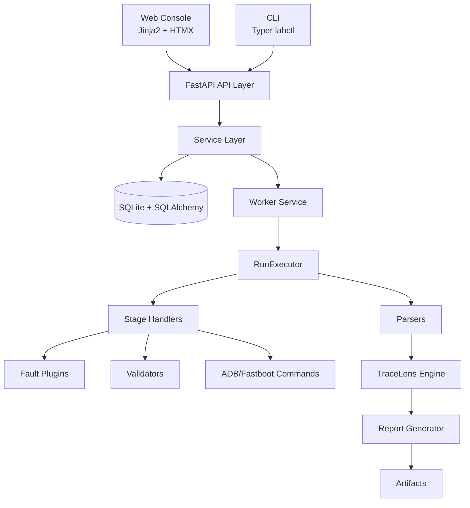
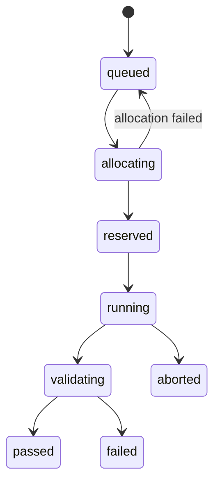
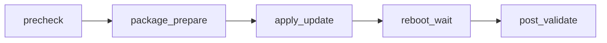
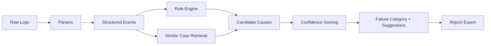

# AegisOTA 面试题与参考答案（项目定制版）

> 适用对象：后端开发 / 测试开发 / 平台工程 / 技术负责人
> 目标：围绕 AegisOTA 的真实架构与实现，进行“可追问、可评估、可落地”的技术面试

---

## 1. 项目全景图

### 1.1 系统分层图

### 1.2 任务状态机图

### 1.3 执行阶段流程图

---

## 2. 架构与设计类面试题

### Q1：请你解释 AegisOTA 的“控制面 + 执行面”分层价值。

- 考察点：分层思想、可扩展性、故障隔离、演进能力。
- 参考答案：控制面负责 API、调度与状态管理，执行面负责设备操作与阶段执行。这样做能把“业务编排逻辑”和“高波动设备操作”隔离，避免 ADB 不稳定直接污染 Web 服务稳定性。控制面可水平扩展为多实例，执行面可扩展为多 worker 并发。出现执行异常时，状态和证据仍可在控制面持久化，便于复盘。
- 追问：如果未来要支持远程设备农场，分层上需要新增什么抽象？

### Q2：为什么任务状态机要拆成 `queued -> allocating -> reserved -> running -> validating -> terminal`？

- 考察点：状态建模、并发一致性、可观测性。
- 参考答案：`allocating` 体现“选设备”过程，`reserved` 体现“占用设备租约已生效”，这两个状态分离可以减少并发抢占冲突；`running` 与 `validating` 分离可避免“执行成功但验证失败”被混淆。终态细分为 `passed/failed/aborted`，便于统计 SLA 与失败归因。
- 追问：如果出现 worker 崩溃，你会如何从中间状态恢复？

### Q3：设备池 `stable/stress/emergency` 设计的核心业务意义是什么？

- 考察点：资源治理、优先级与抢占策略。
- 参考答案：`stable` 提供回归稳定性，`stress` 承接高并发压力任务，`emergency` 保证高优先级任务可抢占资源。池化管理让调度策略可配置，避免“设备列表硬编码”导致资源利用率低与冲突高。
- 追问：你会怎么设计 `reserved_ratio` 才更合理？

### Q4：为什么 fault injection 用插件机制而不是写死在执行器里？

- 考察点：开闭原则、可测试性、场景扩展。
- 参考答案：插件机制使故障场景新增时无需改核心执行器，减少回归风险。统一 `prepare()/inject()/cleanup()` 生命周期可以稳定接入点，也便于对每个插件做隔离测试。执行器只关心“何时调用”，插件关心“怎么注入”。
- 追问：如果某插件 cleanup 失败，你会如何兜底？

---

## 3. 执行链路与并发控制面试题

### Q5：从提交任务到报告产出，讲一遍主链路。

- 考察点：端到端理解能力。
- 参考答案：任务提交后进入队列；调度阶段分配设备并创建 lease；执行器按阶段推进并记录阶段事件；故障插件按触发点执行；验证器收集升级后健康状态；日志导出后交给解析器；TraceLens 规则引擎分类失败原因并给出置信度；报告模块汇总结构化结果并落到 artifacts 与数据库。
- 追问：你会把“重试策略”放在调度层还是执行层，为什么？

### Q6：`DeviceLease` 为什么是关键模型？

- 考察点：资源一致性、并发冲突处理。
- 参考答案：Lease 是设备占用的事实来源，可防止同一设备被多个 run 同时使用。它还记录 `active/released/preempted`，支持回溯“为什么任务被中断”。没有 lease，调度只能靠瞬时查询，容易出现竞态条件。
- 追问：如何防止 lease 泄漏导致设备永远 busy？

### Q7：你如何设计任务超时与中断恢复？

- 考察点：可靠性设计、失败恢复。
- 参考答案：每阶段设独立 timeout，超时后记录阶段失败原因并进入 `aborted` 或 `failed`。恢复时优先做“资源清理动作”而不是直接重试，确保设备回到可复用状态。对关键命令加幂等保护，保证重复执行不会扩大损害。
- 追问：`reboot_wait` 阶段你会如何区分“慢”与“死机”？

### Q8：如果高优先级任务到来，你怎样处理 preemption？

- 考察点：调度策略、业务公平性。
- 参考答案：先从可抢占池筛选低优先级运行任务，检查是否处于可中断安全点，再标记 lease 为 `preempted`，触发当前任务收尾与证据保存，释放设备给高优任务。策略上要设置抢占配额和冷却期，避免一直打断普通任务。
- 追问：什么阶段最不适合抢占，为什么？

---

## 4. 故障注入与验证体系面试题

### Q9：请解释一个故障注入插件的完整生命周期。

- 考察点：接口契约与执行语义。
- 参考答案：`prepare` 用于建立前置条件，例如限制电量阈值；`inject` 在指定阶段触发异常；`cleanup` 用于恢复环境避免污染后续 run。三阶段分离能降低副作用并提升测试可重复性。
- 追问：`inject` 抛异常时是否还应该执行 `cleanup`？

### Q10：`low_battery` 与 `storage_pressure` 的价值差异是什么？

- 考察点：测试覆盖面与缺陷类型映射。
- 参考答案：`low_battery` 更偏“升级前门槛校验与电源稳定性”；`storage_pressure` 更偏“空间不足导致包解压、日志落盘、升级脚本行为异常”。两者覆盖的是不同失败域，组合使用更容易发现边界条件漏洞。
- 追问：你会如何判定这两个场景测试通过？

### Q11：为什么 post-validate 需要多验证器组合？

- 考察点：质量门禁设计。
- 参考答案：单一验证（如只看版本号）容易“假通过”。组合验证器可覆盖启动完整性、功能可用性、性能回归、稳定性压力等维度。多验证器结果可结构化聚合，便于报告展示和失败分类。
- 追问：你会怎么给多个验证结果设置权重？

---

## 5. 诊断与可观测性面试题

### Q12：TraceLens 的输入、处理、输出分别是什么？

- 考察点：诊断流水线建模能力。
- 参考答案：输入是 recovery/update_engine/logcat/monkey 等原始日志；处理是 parser 抽取结构化事件 + rule engine 匹配 + similar case 检索 + confidence 计算；输出是失败分类、证据链、建议动作与可导出报告。
- 追问：规则命中冲突时如何决策主因？

### Q13：规则引擎与相似案例召回为什么要并存？

- 考察点：规则系统边界与经验系统补强。
- 参考答案：规则引擎对已知故障可解释性强、结果稳定；相似案例对未知或半结构化故障更有弹性。并存可以实现“确定性 + 经验性”互补，提高召回率并降低误判。
- 追问：你会如何评估召回质量是否在变差？

### Q14：如何设计“可复盘”的证据链？

- 考察点：可观测性与工程闭环。
- 参考答案：每个阶段记录时间戳、执行命令、返回码、关键日志片段、设备状态快照；最终报告需能回溯到 run、stage、artifact 路径。证据链必须能支撑“复现问题”和“判责边界”。
- 追问：证据采集太多导致存储压力，你如何做分层保留？

### 诊断流程图

---

## 6. API、CLI 与工程实践面试题

### Q15：为什么该项目同时保留 API 和 CLI 两种入口？

- 考察点：工程可用性与操作场景。
- 参考答案：API 面向平台集成、Web 控制台与自动化系统；CLI 面向测试开发本地操作、批处理和排障。双入口共享服务层，避免逻辑分叉，既保证开发效率也保证一致性。
- 追问：如何避免 API 与 CLI 参数语义不一致？

### Q16：`api -> services -> executors/models` 分层有哪些硬约束？

- 考察点：代码组织与架构纪律。
- 参考答案：Route 层只做参数解析与返回协议，不承载业务规则；Service 层负责事务与编排；Executor 负责外部命令与设备动作；Model 层负责持久化结构。这个边界能降低耦合，提升可测性。
- 追问：当你发现 service 特别臃肿时怎么拆？

### Q17：你如何设计这个项目的测试金字塔？

- 考察点：测试策略与成本控制。
- 参考答案：底层是大量单测（parser、rule、validator、fault plugin）；中层是服务层测试（状态流转、调度策略、lease 一致性）；上层是少量集成测试（端到端 run 流程、关键 API）。对外部命令依赖（ADB）用 mock/fake 隔离，关键链路保留少量真实环境回归。
- 追问：你会优先补哪类回归测试，为什么？

### Q18：如果你要提升项目的“线上可运维性”，第一步做什么？

- 考察点：工程化与可运维意识。
- 参考答案：先统一结构化日志和关键指标（任务吞吐、成功率、阶段耗时、设备利用率、失败分类分布），再做告警阈值。没有统一观测就无法判断优化是否有效。
- 追问：你会为哪三个指标先设告警？

---

## 7. 现场系统设计加分题（高级）

### Q19：设计“多 worker 并发执行 + 去重调度”的方案。

- 考察点：分布式一致性、任务幂等。
- 参考答案：使用数据库事务 + 乐观锁或行级锁保证任务只被一个 worker 领取；run 领取时写入 worker_id 与 heartbeat；超时无心跳则回收任务。设备分配依赖 lease 唯一约束，防止双占用。关键动作使用幂等键（run_id + stage）避免重复执行副作用。
- 追问：SQLite 场景下高并发瓶颈怎么处理？

### Q20：如何把诊断规则系统演进为“可灰度”的规则平台？

- 考察点：规则生命周期管理。
- 参考答案：为规则增加版本、启用状态、作用范围（机型/版本/池），支持 A/B 命中统计和回滚；报告中记录命中的规则版本，保证可追责。先灰度到部分任务，观察误判率再全量发布。
- 追问：你会怎么定义“误判率”并自动计算？

---

## 8. 面试评价清单（给面试官）

### 8.1 能力维度

- 架构抽象能力：能否解释分层边界和演进路径。
- 可靠性思维：是否主动谈幂等、超时、恢复、清理。
- 并发一致性：是否能识别租约与调度竞态问题。
- 可测试性：是否能提出分层测试策略与 mock 边界。
- 可运维性：是否能提出指标、日志、告警与复盘闭环。

### 8.2 评分建议（5 分制）

- 5 分：答案结合状态机、lease、插件生命周期和诊断链路，能给出取舍与改进路径。
- 4 分：理解主流程，能覆盖大部分关键点，偶有细节不足。
- 3 分：能描述功能，但对并发、恢复、可观测性理解不深。
- 2 分：只会讲表层功能，缺乏架构和工程视角。
- 1 分：对项目核心链路和概念理解明显不足。

---

## 9. 快速面试脚本（30-45 分钟）

1. 5 分钟：Q1 + Q2（看架构抽象与状态机理解）。
2. 10 分钟：Q5 + Q6 + Q8（看执行链路和并发控制）。
3. 10 分钟：Q9 + Q12 + Q13（看故障注入与诊断系统理解）。
4. 10 分钟：Q16 + Q17 + Q19（看工程化与系统设计能力）。
5. 5 分钟：候选人反问与总结。

---

## 10. 使用建议

- 如果面试对象偏测试开发，优先 Q9-Q14-Q17。
- 如果面试对象偏后端平台，优先 Q1-Q8-Q19-Q20。
- 如果面试对象偏技术负责人，重点观察是否能把“质量、效率、成本”一起平衡。
